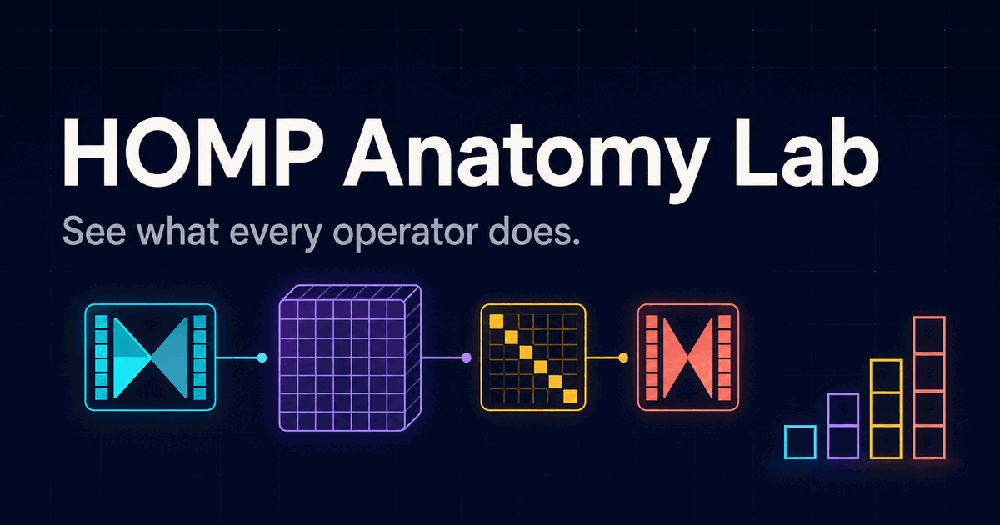

# HOMP Anatomy Lab

An interactive, color-coded visualization of higher-order message passing (HOMP), combinatorial-complex attention, Hodge raising/lowering operators, and multiscale dynamics.

**Live demo:** [homp-anatomy-lab.stochasticcockatoo.chatgpt.site](https://homp-anatomy-lab.stochasticcockatoo.chatgpt.site)



## What the lab visualizes

The interface separates mathematical jobs that are often compressed into one message-passing equation:

- **Topology:** which cells may communicate
- **State:** the cochain or feature tensor being transformed
- **Feature mixing:** the learned right-hand operator
- **Attention:** which permitted routes matter now
- **Transport:** how representations translate between local spaces
- **Aggregation:** how messages combine within and between neighborhood types
- **Hodge closure:** down→up plus up→down incidence round trips
- **Dynamics:** flux, memory, sources, sinks, ranks, and timescales

Every top-level tab contains a deterministic synthetic graph with numerical features, route weights, intermediate messages, aggregations, and outputs.

## Five interactive lenses

### 1. Operator sandwich

\[
K_j = G_{j\leftarrow i} H_i W_{i\to j}
\]

Four synthetic neurons send two-channel features to two assemblies. The visualization distinguishes the left operator, which changes the **cell axis**, from the right operator, which changes the **feature axis**.

### 2. Cross-rank attention

\[
K_t = (G_{t\leftarrow s}\odot A_{s\to t})H_sW_{s\to t}
\]

Weighted edge↔face communication makes the structural mask and attention coefficients separately visible. Reversing direction transposes the permitted incidence structure while recomputing outputs.

### 3. HOMP pipeline

The interface walks through:

1. construct a typed message,
2. attend and aggregate inside each neighborhood,
3. weight and merge neighborhood channels,
4. update the receiver.

The synthetic receiver has incidence, upper-adjacency, and temporal neighborhoods with two senders each.

### 4. Raise + lower

\[
L_k = \underbrace{B_k^\top B_k}_{\text{down, then up}} + \underbrace{B_{k+1}B_{k+1}^\top}_{\text{up, then down}}
\]

Runnable graph, simplicial-complex, hypergraph, and combinatorial-complex examples show where incidence operators actually act. A filled/unfilled triangle exposes the harmonic cycle and the change in \(\beta_1\).

### 5. Multiscale dynamics

\[
\dot h_r = f_r(h_r) + \sum_s \alpha_{sr}(t)T_{sr}m_{sr} + M_r[h(\tau<t)] + S_r - D_r
\]

A deliberately broader synthesis connects CC routing to sheaf-like transports and multiscale physics. Click any scale to make it the receiver and recompute the local, cross-scale, memory, source, and sink terms.

## Run locally

Requires Node.js 22.13 or newer.

```bash
npm ci
npm run dev
```

Then open the local URL printed by Vite.

Useful checks:

```bash
npm run lint
npm run build
```

## Main source files

- `app/page.tsx` — equations, synthetic datasets, simulations, and interactions
- `app/globals.css` — color system, graph styling, and responsive layout
- `app/layout.tsx` — metadata and social preview configuration

## Mathematical scope

Tabs 1–4 visualize CC push-forwards, attention-HOMP, and Hodge rank closure. Tab 5 is a proposed synthesis rather than a standard HOMP identity. In particular, an incidence transpose is an adjoint rank map inside one complex; it should not automatically be conflated with a functorial pullback between spaces.

## References

- [Topological Deep Learning: Going Beyond Graph Data](https://arxiv.org/abs/2206.00606)
- [Combinatorial Complex Neural Networks](https://tdlbook.org/combinatorial-complex-neural-networks)
- [Higher-Order Message Passing](https://tdlbook.org/message-passing)
- [Sheaf Attention Networks](https://openreview.net/pdf?id=LIDvgVjpkZr)

## License

No license has been selected yet. The code is publicly visible, but reuse rights remain reserved until a license is added.
